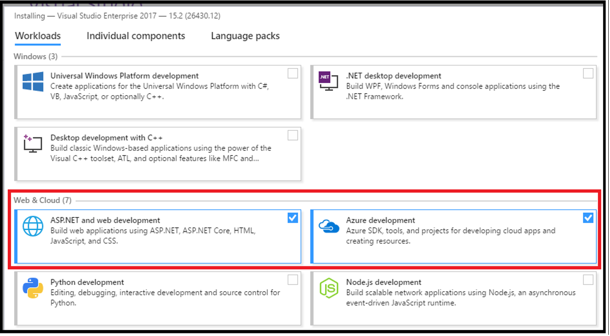

## 제목 : Azure Serverless 핸즈온랩 워크샵

클라우드는 IaaS를 넘어, PaaS로 그리고 PaaS를 넘어 마이크로 PaaS인 서버리스로 그 관심이 옮겨가고 있습니다. 서버의 인프라를 직접 관리하거나, 운영할 필요가 없는 서버리스 기술은 이미 많은 기업의 개발자들이 주목하고 있는 핫한 기술입니다. 

이번 HOL에서는 Azure에서 제공하는 서버리스 기술인 Function App과 Logic App을 직접 코딩하고 개발하면서 그 뛰어난 유연성과 효율성을 직접 느낄 수 있도록 할 예정입니다. 우선 서버리스의 기본적인 개요를 전문 강사의 기술 세션을 통해서 살펴본 뒤, 초급부터 중급에 이르는 다양한 실습들을 각자 자신의 노트북에서 직접 Coding 해 보는 시간을 갖습니다.

자주 접하기 쉽지 않은 '실습' 워크샵이기에 서버리스를 배워보고 싶으는 분들은 이번 HOL을 놓치지 마세요!

#### **대상** : 기업에서 근무하는 초, 중급 개발자

#### **강사** : 한국 마이크로소프트 김태영 부장 (feat. Taeyo)

#### 실습시간(예상) : 5 시간 

#### 참가자 특전 : (원할 경우) 서버리스 관련 무료 컨설팅/핵페스트 프로그램 제공 

## HOL(Hands-on Lab) 진행 순서

### 기술 세션 : Azure의 Serverless 컴퓨팅 I (60분)

- 실습 준비 (20분)
    - 필요한 Azure 리소스 생성
        - 리소스 그룹, 저장소 계정, 앱 서비스 계획 등

- 실습 1 : 온라인으로 Azure Functions 개발 실습 (20분)
    - Azure Portal을 통한 코딩 실습
	- 브라우저 및 PostMan을 사용한 테스트
    - 트리거, 바인딩 실습
	- 모니터링 및 관리 테스트

- 실습 2 : Azure CLI를 이용한 Function 개발 실습 (20분) 
	- Command Line Interface를 통해서 개발
    - 로컬 머신 테스트
	- Function pack을 이용한 서버 배포

- 실습 3 : 이미지 프로세싱 실습 (30분)
    - Blob 트리거와 이미지 프로세싱 실습 
    - 기존 개발되어 있는 소스를 사용하여 변형 실습
    - 시나리오
        - 인물 사진을 Blob 저장소에 저장하면
        - 해당 이미지를 Microsoft AI : Vision API로 분석하여
        - 행복 지수에 따라 이미지 배경을 변경 및 이름과 직급을 기입
        - Output용 Blob 저장소에 변형된 이미지를 저장

- 실습 4 : Visual Studio를 이용한 Function 개발 실습 (20분)
    - 참고 링크 : [http://docs.microsoft.com/en-us/azure/azure-functions/functions-develop-vs](http://docs.microsoft.com/en-us/azure/azure-functions/functions-develop-vs)   
	- 최강의 RAD/IDE 도구인 Visual Studio를 이용한 실습
	- Queue 트리거를 통한 메시지 수신
    - 로컬 디버깅 실습
    - VS를 사용한 빠른 배포 실습

### 미니 세션 : 서버리스 핵페스트 프로그램 소개 (10분)

### 기술 세션 : Azure의 Serverless 컴퓨팅 II (20분)

- 실습 5 : Logic 앱을 사용한 워크플로우 실습 (30분)
	- Facebook과 Blob Storage(Dropbox) 연계 실습
    - 시나리오
        - 자신의 페이스북 담벼락에 글을 남기면
        - 그 텍스트를 음성으로 변환(Text to Sppech)하고
        - 지정된 Blob 저장소에 파일로 생성함
        - (option) 생성된 음성 파일을 DropBox에도 생성

- 실습 6 : Azure Function + Logic App 종합 실습 (60분)
    - 참고 링크 : [http://docs.microsoft.com/en-us/azure/azure-functions/functions-twitter-email](http://docs.microsoft.com/en-us/azure/azure-functions/functions-twitter-email)     
    - 페이스북에 부정적인 글이 올라오면(영어)
    - 그 구문의 sentiment(감정)을 해석해서, 신호등 색상으로 상태를 판단
    - 'Red' 상태인 경우에는 관리자에게 메일로 그 사실을 통보
    
### 모든 참가자는 다음의 사항들을 반드시 본인의 노트북에 설치하고 오셔야 합니다. 

MacBook 유저의 경우에는 가상화를 통해서 Windows OS를 준비하시거나 별도의 Windows 노트북을 지참하시는 것을 권장합니다. 이는 MacBook에는 Visual Studio (Windows)를 설치할 수 없기에 일부 실습(예, 실습 4)을 수행하실 수 없기 때문입니다

### 참가자 준비물 (필수)
> 1. 노트북 (Windows OS)
> 2. Azure 계정(무료 계정이든, MSDN 계정이든, 회사 계정이든)  
> 3. 테더링 가능한 스마트폰(네트워크 사정이 안 좋을 경우 테더링을 강추합니다)  

**준비물 미 준비 시에는 실습을 제대로 따라하실 수 없으며, 그 부분은 본인의 책임입니다**

### 강좌 참여 시 사전 준비 및 설치 사항(필수)
> - Visual Studio 2017. (Community 버전 무관)  
>   (빨간 박스로 표시한 Azure 개발은 필수이며, 그 밖에 필요한 것 설치)  
>   이미 설치한 사람은 반드시 업데이트를 해서 **15.4 버전** 이상으로 업데이트    
>   
>    
> - Visual Studio Code 설치 : https://code.visualstudio.com/  
> - Azure CLI 설치
>   - Windows : https://aka.ms/InstallAzureCliWindows    
>   - Mac OS : https://docs.microsoft.com/en-us/cli/azure/install-azure-cli?view=azure-cli-latest  
> - Node 8.5 이상의 Stable 버전 설치 (9.X 버전은 안됩니다)
>   - https://nodejs.org/en/
> - .NET Core 2.0 런타임 설치 
>   - x64 : [https://www.microsoft.com/net/download/thank-you/dotnet-runtime-2.0.3-windows-x64-installer](https://www.microsoft.com/net/download/thank-you/dotnet-runtime-2.0.3-windows-x64-installer)
>   - x86: [https://www.microsoft.com/net/download/thank-you/dotnet-runtime-2.0.3-windows-x86-installer](https://www.microsoft.com/net/download/thank-you/dotnet-runtime-2.0.3-windows-x86-installer)
> - Azure Functions Core Tools 설치 (CMD 명령 프롬프트에서 실행) 
>   - Windows : npm i -g azure-functions-core-tools@core    
>   - Mac OS : sudo npm i -g azure-functions-core-tools@core --unsafe-perm   
> - Azure Functions Pack 설치 (CMD 명령 프롬프트에서 실행) 
>   - npm i -g azure-functions-pack    
> - Postman 설치
>   - https://www.getpostman.com/postman     
> - Azure Storage Explorer 설치
>   - https://azure.microsoft.com/en-us/features/storage-explorer/
> 
> ## 꼭 미리 설치하고 오세요!!!!